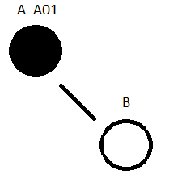
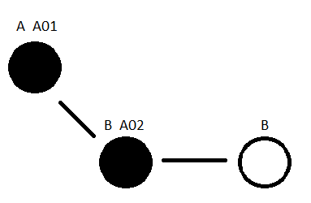
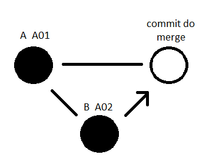
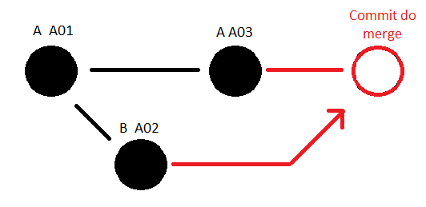
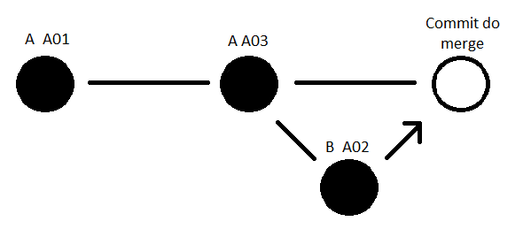
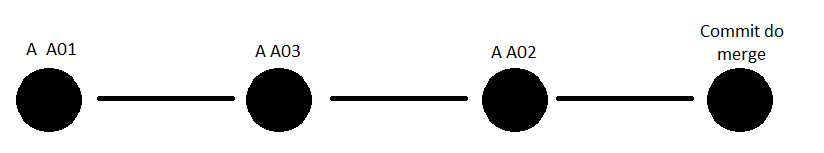

# Git

## Sobre os EXERCICIOS

A coisa mais importante é entender o conteúdo. Então para atingir esse objetivo faça o seguinte:

- Tente refazer os exercicios sempre sem olhar nada. **ATENÇÃO**: Tudo dever ocorrer exatamente conforme o exercicio se algo aconteceu diferente algo errado foi feito
- A cada novo exercicio REFAZER todos os anteriores. Quanto mais tu precisar ler a explicação para atingir deternada situação, menos tu tem isso fixado.
- Depois que todos esse exercicios forem feitos e devidamente entendidos tentar fazer os exercicios do [learngitbranching](https://learngitbranching.js.org/?locale=pt_BR). O site possui conteúdo a mais mas vale a pena saber e entender todos 😀

> **ATENÇÃO**: Isso se aplica apenas aos exercicios e não deve ser feito novamente os passo da explicação

## Índice

  
Branch

&emsp;&emsp;[Explicação](#branch)\
&emsp;&emsp;[Exercicio](#exercicio)

  
Merge

&emsp;&emsp;[Explicação](#merge)\
&emsp;&emsp;[Exercicio](#exercicio-1)

  
Conflitos

  
Rebase

&emsp;&emsp;[Explicação](#rebase)\
&emsp;&emsp;[Exercicio](#exercicio-2)

  
Cherry-pick

  
Squash

## Branch

Pensa no git como uma linha do tempo. A main(_principal_) é a linha do tempo que como o próprio nome diz é a principal e a partir dessa linha do tempo principal tu pode contruir diferentes histórias(_códigos_). Porém para não afetar a linha do tempo principal tu cria uma branch(_ramificação_) e isso faz com que tudo que aconteça nessa linha do tempo alternativa(_a branch criada_) não afete a linha do tempo principal.

Nessa branch(_exercicios-de-branch_) nós iremos avacalhar a história para que tu entenda como funciona isso e como ser uma viajante no tempo(_poder alternar entre essa branch e a main_)

O que fazer nessa branch:

- Excluir todo os arquivos, exceto o README.md
- Criar um arquivo de texto chamado TEXTO.md
- Escrever no TEXTO.md _"# Primeira Linha do tempo"_
- Fazer o commit com a mensagem _"Primeira linha do tempo"_

Nesse momento essa linha do tempo ja esta bem diferente da principal e agora tu vai ver

- Dar o comando _"git log"_. Esse comando vai mostar o histórico de commits desde o inicio do projeto, para navegar ele tu utiliza as setinha do teclado e não o scroll do mouse e para sair tu aperta 'q'
- Sair do git log com o _"q"_
- Alternar para a branch main

Agora tu vai perceber que todo o teu código voltou e isso acontece porque tudo que aconteceu na branch alternativa existiu apenas naquela branch e não afeta a branch principal

- Dar o comando _"git log"_. Vai ver que o commit _"Primeira linha do tempo"_ não existe
- Sair do git log
- Verificar os arquivos na IDE que irão ter aparecido novamente
- Voltar para a branch _"exercicios-de-branch"_
- Dar o comando _"git log"_. Vai ver que o commit _"Primeira linha do tempo"_ apareceu novamente
- Sair do git log
- Verificar os arquivos na IDE que sumiram novamente porque foi excluído naquele commit

> **NOTA**: O commit representa um ponto importante na história onde algo aconteceu. IMPORTANTE ter em mente que quando tu altera os aquivos e não commita eles não importam na linha to tempo não sendo enviador para o GitHub e ainda podem até não te deixar mudar de branch por não terem sido commitados(_salvos_). Nesse caso tu tem que decidir se tu abandona as alterações ou se tu as commita para criar esse ponto importante na história

<a href="#índice">Voltar ao índice ⬆️ </a>

#### Exercicio

- Criar uma branch _"segunda-linha-do-tempo"_ a partir da _"exercicios-de-branch"_
- Alterar o titulo do TEXTO.md _"# Primeira Linha do tempo"_ para _"# Segunda Linha do tempo"_
- Fazer o commit com a mensagem _"Segunda linha do tempo"_
- Dar o comando _"git log"_. Vai ver que tem o commit _"Primeira Linha do tempo"_. Sabe o por quê?
- Alterar para a branch _"exercicios-de-branch"_
- Dar o comando _"git log"_
- Excluir a branch _"segunda-linha-do-tempo"_

> **IMPORTANTE**: Se tu não fez o git push, que não pedi para tu fazer em nenhum momento. Tu vai ver que os arquivos ainda existem no GitHub e isso se dá porque tu não atualizou o GitHub. Não esquece que existem dois ambientes o local(_Git_) e o remoto(_GitHub_). E as coisas que neles só são atualizadas se tu as atualizar manualmente. _"git push"_ para enviar tuas alterações para o ambiente remoto e _"git pull"_ para buscar as alterações do ambiente remoto

<a href="#índice">Voltar ao índice ⬆️ </a>

## Merge

O merge é o evento em que tu mistura as linhas do tempo. Por exemplo, digamos que tinha a linha do tempo A e criou a B. Na linha do tempo B tu começou a escrever uma nova história e tu decidiu que gostou de todas aquela decisões tomadas na linha do tempo B. Nesse caso tu mesclar(_mergiar_) as duas

Vamos criar uma nova linha do tempo(_meu-primeiro-merge_) fazer alterações e então mergiar com _"exercicios-de-branch"_

- Na branch _"exercicios-de-branch"_ execute _"git log"_ para verificar qual o ultimo commit existente
- Criar a branch _"meu-primeiro-merge"_ a partir da _"exercicios-de-branch"_ e ir para ela
- Alterar o texto do arquivo _"TEXTO.md"_ para _"Meu primeiro merge"_ e commitar
- Alternar para a branch _"exercicios-de-branch"_. CUIDADO: Antes de executar o próximo passo tenha certeza que esta na branch _"exercicios-de-branch"_
- Mergiar a branch _"exercicios-de-branch"_ com a _"meu-primeiro-merge"_. O comando é _"git merge &lt;nome-da-branch&gt; --no-ff"_. Por exemplo, _"git merge meu-primeiro-merge --no-ff"_. Ao usar o comando _"git merge &lt;nome-da-branch&gt; --no-ff"_ o Git sempre irá cria um commit para registar o evento. O comando _"git merge &lt;nome-da-branch&gt;"_ apenas gera o commit automático em algumas situações para evitar isso usa-se a opção _"--no-ff"_
- _"git log"_ e tu ira ver que o commit que tu criou na branch _"meu-primeiro-merge"_ agora esta na branch _"exercicios-de-branch"_ juntamente com o commit criado pelo merge
- _"git branch -D meu-primeiro-merge"_ para excluir a branch

<a href="#índice">Voltar ao índice ⬆️ </a>

#### Exercicio

- Criar uma branch _"exercicio-merge-1"_ a partir da _"exercicios-de-branch"_
- Criar um arquivo de texto _"PRIMEIRABRANCH.md"_ com o texto _"Essa é a primeira branch"_ e commita-lo
- Criar uma branch _"exercicio-merge-2"_ a partir da _"exercicios-de-branch"_
- Criar um arquivo de texto _"SEGUNDABRANCH.md"_ com o texto _"Essa é a segunda branch"_ e commita-lo
- Ir para a branch _"exercicio-merge-1"_ e fazer o merge da _"exercicio-merge-2"_ com ela
- Verificar os registros dos commits _"git log"_
- Ir para a branch _"exercicios-de-branch"_
- Excluir as branchs _"exercicio-merge-1"_ e _"exercicio-merge-2"_

<a href="#índice">Voltar ao índice ⬆️ </a>

## Rebase

O rebase também é um evento em que tu mistura as linhas do tempo. Porém ele não cria um commit e **_altera o ponto inicial da história_**. Por exemplo, digamos que tinha a linha do tempo A e tu criou a B baseado no commit A01 da linha do tempo A \

Na linha do tempo B tu começou a escrever uma nova história e tu decidiu que gostou de todas aquela decisões tomadas na linha do tempo B criando um commit \

Nesse caso tu iria mergiar A com B \

Porém alguém alterou a linha do tempo A. Agora o commit mais atualizado da branch é o A03 e é recomendado mergiar A com B para garantir que as alterações de B ainda funcionam como esperado \

> _NOTA_: A parte que esta em vermelho demonstra o que aconteceria se simplesmente fosse feito o _"git merge &lt;nome-da-branch&gt; --no-ff"_ de A com B

Agora, para garantir que as alterações de B ainda fazem sentido com o A atualizado, iremos redefinir o commit base de B para A03 com _"git rebase &lt;nome-da-branch&gt;"_ evitando um commit de merge, e então, podendo validar as alterações de B \

> _IMPORTANTE_: Observe que o código foi mergiado utilizando o rebase. Agora o ponto inicial de B não é A01 e sim A03. Isso porque nós **_alteramos o commit base_**, alteramos o ponto inicial da história, por isso _"RE BASE"_ \

Agora com B atualizado podemos fazer o merge de A com B sem medo \

Como o rebase é um evento que redefine o ponto inicial da linha do tempo. O que faremos é alternar a história para uma diferente linha do tempo no evento EV01. Construir uma história que gostamos, a EV02, nessa nova linha do tempo e então iremos mesclar essa linha do tempo com a principal que agora esta em um evento posterior ao evento EV01, o evento EV03. Porém para garantir que o evento que vivemos(EV02) na linha do tempo alternativa ainda é possivel de acontecer. Iremos alternar o ponto inicial dessa nova linha do tempo para o EV03 e então misturar a nova linha do tempo com a principal

- Criar a branch _"meu-primeiro-rebase"_ a partir da _"exercicios-de-branch"_ e ir para ela
- Criar um arquivo de texto _"MEUPRIMEIROREBASE.md"_ com o texto _"Meu primeiro rebase"_ e commitar
- _"git log"_ e tu ira ver que o commit que o commit _"Meu primeiro rebase"_ agora consta no histórico
- Alternar para a branch _"exercicios-de-branch"_
- Renomear o arquivo _"TEXTO.md"_ para _"MEUPRIMEIROMERGE.md"_ com o texto _"Meu primeiro merge"_ e commitar
- _"git log"_ e tu ira ver que o commit que o commit _"Meu primeiro merge"_ agora consta no histórico.
- Alternar para a branch _"meu-primeiro-rebase"_
- Alterar o commit base da branch _"meu-primeiro-rebase"_ para o ultimo commit da branch _"exercicios-de-branch"_ com o commando _"git rebase exercicios-de-branch"_
- _"git log"_ e tu ira ver que o commit que o commit _"Meu primeiro merge"_ agora consta no histórico. Como se ele sempre estivesse lá
- Alterar para a branch _"exercicios-de-branch"_
- _"git merge meu-primeiro-rebase --no-ff"_
- _"git log"_ e tu ira ver que o commit que o commit _"Meu primeiro rebase"_ agora consta no histórico juntamente com o commit do merge
- _"git branch -D meu-primeiro-rebase"_ para excluir a branch

<a href="#índice">Voltar ao índice ⬆️ </a>

#### Exercicio

- Criar uma branch _"exercicio-rebase-1"_ a partir da _"exercicios-de-branch"_
- Criar um arquivo de texto _"PRIMEIRO.md"_ com o texto _"Primeiro"_ e commita-lo
- Verificar os registros dos commits _"git log"_
- Criar uma branch _"exercicio-rebase-2"_ a partir da _"exercicio-rebase-1"_
- Criar um arquivo de texto _"SEGUNDO.md"_ com o texto _"Segundo"_ e commita-lo
- Verificar os registros dos commits _"git log"_
- Ir para a branch _"exercicio-rebase-1"_
- Criar um arquivo de texto _"TERCEIRO.md"_ com o texto _"Terceiro"_ e commita-lo
- Verificar os registros dos commits _"git log"_
- Ir para a branch _"exercicio-rebase-2"_
- Altera o ponto inicial para o ultimo de _"exercicio-rebase-1"_
- Verificar os registros dos commits _"git log"_
- Ir para a branch _"exercicio-rebase-1"_ e fazer o merge da _"exercicio-rebase-2"_ com ela
- Verificar os registros dos commits _"git log"_
- Ir para a branch _"exercicios-de-branch"_
- Excluir as branchs _"exercicio-rebase-1"_ e _"exercicio-rebase-2"_

<a href="#índice">Voltar ao índice ⬆️ </a>

