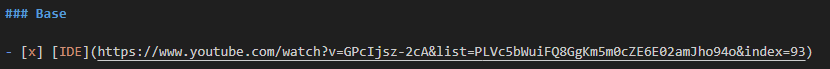

# Vídeos

Esses são os vídeos que eu selecionei do canal [Código fonte TV](https://www.youtube.com/@codigofontetv) que fazem sentido tu assistir para o contribuir tanto no aprendizado do **Flutter** quanto no conhecimento geral de assuntos relacionados ao desenvolvimento de software. Enquanto alguns são importantes tu entender a fundo outros apenas o entender e conhecer já basta

Para marcar o vídeo como visto basta adicionar um "x" dentro dos colchetes "[ ]" no arquivo README.md. Exemplo:

**README.md** \

**Como fica no GitHub** \

Após ver o vídeo escrever um resumo com tuas palavras abaixo. Para não precisar reassisti-los no futuro

### Base

- [x] [IDE](https://www.youtube.com/watch?v=GPcIjsz-2cA&list=PLVc5bWuiFQ8GgKm5m0cZE6E02amJho94o&index=93)

"ide - ambiente de desensvolvomento integrado
Ambiente que reune funcionalidades que auxiliam o programador no desenvolvimento, para maior produtividade. Como, capacidade de rodar, compilar e executar o codigo. Capacidade para debugar linha a linha e de indentificar erros de sintasse e execucao.

o que uma ide deve conter:
editor de codigo, compilador, link, debug, modelador - modelagem de classes, objetos e demais funções de linguagem, gerador de codigo, deploy, testes automatizados, refatoração, integraçao com congtrole de versao, shell integrado - linha de comando."

- [x] [POO](https://www.youtube.com/watch?v=QY0Kdg83orY&list=PLVc5bWuiFQ8GgKm5m0cZE6E02amJho94o&index=146)

Paradigma de desenvolvimento, contrário ao procedural, suportado por diversas linguagens e utilizado em diversas fases do desenvolvimento, não somente na linguagem.
Tem como objetivo representar o mundo real em objetos(aglutinação de estados e comportamentos). 
Ajudam na leitura, reutilização e manutenção do código.
Pilares:
herança - caracteristicas podem ser recplicadas de um objeto para o outro
polimorfismo - objetos compativeis, reescrita de um metodo herdada de uma classe
encapsulamento - capacidade de esconder detalhes da implementação do objeto, adiciona segurança na aplicação
abstração - representar objeto de forma abstrata, criação feita somente a partir de classes filhas, nunca da superclasse

- [x] [Java](https://www.youtube.com/watch?v=sZAxLRMxEUo&list=PLVc5bWuiFQ8GgKm5m0cZE6E02amJho94o&index=100)

- [x] [CLI](https://www.youtube.com/watch?v=8AgOxHOAV9Y&list=PLVc5bWuiFQ8GgKm5m0cZE6E02amJho94o&index=34)

Command Line Interface - comunicação por linha de comando.
Utilizado para executar tarefas no sistema operacional ou em um determinado ambiente. 
Possiu vantagem em eficiencia e agilidade na automatização e controle. Cada CLI tem comandos expecíficos.

- [x] [Git](https://www.youtube.com/watch?v=za5KWZ5pRag&list=PLVc5bWuiFQ8GgKm5m0cZE6E02amJho94o&index=83)

GIT
Sistema de controle de versão. Arquitetura/repositório descentralizado, baseada em branchs(linhas de tempo).
Utilizado para permitir alterações simultaneas no código fonte de um projeto, sem que haja sobrescrição de alterações. Criação de novas funcionalidades feitas em novas branchs.

- [x] [GitHub](https://www.youtube.com/watch?v=myQuetgSEsY&list=PLVc5bWuiFQ8GgKm5m0cZE6E02amJho94o&index=85)

Comunidade de código aberto. Plataforma onde será centralizado o repositorio GIT, hospedando na nuvem. Permitindo alterações paralelas. 

- [x] [GitFlow](https://www.youtube.com/watch?v=oweffeS8TRc&list=PLVc5bWuiFQ8GgKm5m0cZE6E02amJho94o&index=84)

Workflow para organização de versionamento de código no repositório. Tipificação de branchs, separadas em principal e de suporte. Onde é criada outra branch principal para criar um paralelo com a master. Utilizando auxiliares para modificações e implementações na produção.
Nas principais temos: Master e Develop. E as de suporte: hotfix (correção de bugs), feature, release(correções liberadas para master).

- [x] [Code Review](https://www.youtube.com/watch?v=_7W9pqWPyfc&list=PLVc5bWuiFQ8GgKm5m0cZE6E02amJho94o&index=38)

Prática da engenharia de software, que realiza revisão do código e verifica se o mesmo cumpre requisitos propostos e se está de acordo com o esperado. Geralmente realizado por outro dev. Melhora do codigo atraves de um outro ponto de vista. Deve ser realizado apos os testes. Desing, funcionalidade, complexidade, segurança, nomenclatura, documentação devem ser levados em consideração na prática.

### Aquece Flutter

- [ ] [Frameworks](https://www.youtube.com/watch?v=2zqzzTnfa0E&list=PLVc5bWuiFQ8GgKm5m0cZE6E02amJho94o&index=79)

- [ ] [Dart](https://www.youtube.com/watch?v=i7IzlVImHEc&list=PLVc5bWuiFQ8GgKm5m0cZE6E02amJho94o&index=52)

- [ ] [Flutter](https://www.youtube.com/watch?v=XkEA4xT34jg&list=PLVc5bWuiFQ8GgKm5m0cZE6E02amJho94o&index=76)

- [ ] [Flutter 2.0](https://www.youtube.com/watch?v=vIP2iLFjEIk&list=PLVc5bWuiFQ8GgKm5m0cZE6E02amJho94o&index=76)

### Bom conhecer

- [x] [Agile](https://www.youtube.com/watch?v=HdE8S2ALvWI&list=PLVc5bWuiFQ8GgKm5m0cZE6E02amJho94o&index=6)

Abodagem de gerenciamento de software. Prega que o processo deve ser em pequenas e constantes entregas. Surgiu no manifesto agil de 2001. Pessoas, não os processos, estao em primeiro lugar. Principios basicos que guiam diversas metodologias ageis.

1. Valor. Entrega continua e adiantada, com valor agregado
2. Flexibilidade. Mudanças nos requisitos sao bem vindas
3. Frequência. Entregar frequentemente software funcionando, visando a menor escala de tempo
4. União. Pessoas de negocio e desenvolvedores devem trabalhar em conjunto
5. Motivação. Construção de projetos em torno de individuos motivados, dando suporte e autonomia
6. Comunicação. Rede de comunicação eficaz entre os indivuduos da equipe, se possivel face-to-face
7. Funcionalidade. Software funcionando é a medida primaria de progresso
8. Sustentabilidade. Processos ageis promovem desenvolvimento sustentavel, os envolvidos devem ser capazes de manter o ritmo contante
9. Revisão. Continua atenção a excelência técnica e a um bom desing aumenta a agilidade
10. Simplicidade. 
11. Organização. 
12. Autoavaliação.

- [x] [SCRUM](https://www.youtube.com/watch?v=3aCww_1RnL0&list=PLVc5bWuiFQ8GgKm5m0cZE6E02amJho94o&index=168)

Abordagem agil de gerenciamento de projetos. Coletivismo e integração. Framework, ou metodologia agil que usa sequencia de trabalho incremental e interativa. Classifica tarefas em estágios, para dar visibilidade do progresso do trabalho. To Do, WIP e Done. Voltado a melhoria continua. 
Elementos: 
Papeis - Equipe e responsaveis pela gestao e desenvolvimento do projeto
Artefatos - Backlog, lista de requisitos da aplicação (product e sprint criado a partis do product). Historias, descritivo claro e objetivo da funcionalidade que seja desenvolvida, tarefas. Burndown, grafico que demonstra a linha de esforço para trabalhos que ja foram e precisam ser realizados (product e sprint).
Eventos - Sprint, ciclo de desenvolvimento com tempo pré determinado. Sprint planing, para definição do tempo para o String Backlog. Daily Scrum, reunioes diarias de planejamento e controle. Sprint review, focado no aceite ou nao do trabalho realizado. Sprint Retrospective, reuniao realizada apos o review, analizar o processo de trabalho. Ver ciclo.

- [x] [DevOps](https://www.youtube.com/watch?v=iwf6kcvxeD4&list=PLVc5bWuiFQ8GgKm5m0cZE6E02amJho94o&index=63)

Devops - development e operations
Cultura de automatização de processos de desenvolvimento e infraestrutura. Cultura de trabalho, com praticas e ferramentas. Praticas agile fazem parte desse distema. Gera velocidade de desenvolvimento e entrega/melhora continua. Confiabilidade e escala.
Praticas:

Integração e entrega continua

Microserviços - Executar atualizações pequenas e frequentes

Infraestrutura como código

Monitoramento e registro de logs

Comunicação e colaboração

- [x] [CI/CD](https://www.youtube.com/watch?v=AZtTd3pFVTY&list=PLVc5bWuiFQ8GgKm5m0cZE6E02amJho94o&index=143)

Continuous Integration e Continuous Delivery. Conjunto de praticas e ferramentas. Automatizar sequencia de etapas que precisam ser executadas para por a aplicação em produção. Automatização, integração de pequenas atualizações. Entrega continuae mais rapida, ligada ao conceito de metodologia agil, multidisciplinar. Rápida confiavel e precisa. 
Ferramentas para costrução e impementação da automação: Jenkins, azure, AWS, entre outros.

- [ ] [Estruturas de dados](https://www.youtube.com/watch?v=EfF1M7myAyY&list=PLVc5bWuiFQ8GgKm5m0cZE6E02amJho94o&index=71)

- [ ] [Padrões de design](https://www.youtube.com/watch?v=J-lHpiu-Twk&list=PLVc5bWuiFQ8GgKm5m0cZE6E02amJho94o&index=61)

- [ ] [BIG O](https://www.youtube.com/watch?v=RGD3iwqDdAE&list=PLVc5bWuiFQ8GgKm5m0cZE6E02amJho94o&index=19)

- [ ] [Aplicações escaláveis](https://www.youtube.com/watch?v=F_d_gWPGejo&list=PLVc5bWuiFQ8GgKm5m0cZE6E02amJho94o&index=11)

- [ ] [MVVM](https://www.youtube.com/watch?v=B2pJWtSyVFA&list=PLVc5bWuiFQ8GgKm5m0cZE6E02amJho94o&index=126)

- [ ] [Debito Tecnicos](https://www.youtube.com/watch?v=7VmpPsF1VuY&list=PLVc5bWuiFQ8GgKm5m0cZE6E02amJho94o&index=56)

- [ ] [Criptografia](https://www.youtube.com/watch?v=qHFbuXpz7e4&list=PLVc5bWuiFQ8GgKm5m0cZE6E02amJho94o&index=45)

- [ ] [UUID](https://www.youtube.com/watch?v=9vtcTJwGt-w&list=PLVc5bWuiFQ8GgKm5m0cZE6E02amJho94o&index=198)

- [ ] [Thread](https://www.youtube.com/watch?v=xNBMNKjpJzM&list=PLVc5bWuiFQ8GgKm5m0cZE6E02amJho94o&index=195)

- [ ] [Refatoração](https://www.youtube.com/watch?v=VOxnyVI2lOc&list=PLVc5bWuiFQ8GgKm5m0cZE6E02amJho94o&index=161)

- [ ] [TDD](https://www.youtube.com/watch?v=bLdEypr2e-8&list=PLVc5bWuiFQ8GgKm5m0cZE6E02amJho94o&index=189)

- [ ] [Pair Programming](https://www.youtube.com/watch?v=5M8yNQSFBPg&list=PLVc5bWuiFQ8GgKm5m0cZE6E02amJho94o&index=138)

- [ ] [JSON](https://www.youtube.com/watch?v=P81dE-tkaaA&list=PLVc5bWuiFQ8GgKm5m0cZE6E02amJho94o&index=102)

- [ ] [API](https://www.youtube.com/watch?v=vGuqKIRWosk&list=PLVc5bWuiFQ8GgKm5m0cZE6E02amJho94o&index=10)

- [ ] [Webhooks](https://www.youtube.com/watch?v=2JHKIrComW0&list=PLVc5bWuiFQ8GgKm5m0cZE6E02amJho94o&index=207)

- [ ] [Deploy](https://www.youtube.com/watch?v=gJw7l2JKpuQ&list=PLVc5bWuiFQ8GgKm5m0cZE6E02amJho94o&index=60)

- [ ] [Integração continua](https://www.youtube.com/watch?v=nI3IjYcBGiU&list=PLVc5bWuiFQ8GgKm5m0cZE6E02amJho94o&index=46)

- [ ] [Lint](https://www.youtube.com/watch?v=0U6lnhLmT2A&list=PLVc5bWuiFQ8GgKm5m0cZE6E02amJho94o&index=112)
